# pelican_tools



**pelican_tools** is a full‑featured toolkit for managing a [Pelican](https://getpelican.com/) static site.
It provides **interactive workflows** for creating and editing articles and generates beautiful, technogeek
**Open Graph banners** and **square thumbnails** — all powered by a flexible SVG‑based rendering engine
with dozens of customisable components.

---

## Table of contents

- [Features](#features)
- [Installation](#installation)
- [Quick start](#quick-start)
- [CLI commands](#cli-commands)
  - [`article` – interactive creation](#article--interactive-creation)
  - [`edit` – update a published article](#edit--update-a-published-article)
  - [`banner` – generate a banner from the command line](#banner--generate-a-banner-from-the-command-line)
  - [`thumbnail` – generate a thumbnail from the command line](#thumbnail--generate-a-thumbnail-from-the-command-line)
- [Configuration & customisation](#configuration--customisation)
- [Project structure](#project-structure)
- [Dependencies](#dependencies)
- [License](#license)

---

## Features

- **Interactive article creation** – guided workflow that sets up title, summary, tags,
  working directories, slug generation, and final Markdown export.
- **Article editing** – edit metadata, body, move articles between categories, and
  regenerate banners/thumbnails without leaving the terminal.
- **Banner generator** – a powerful SVG composer with **35+ components**:
  - Terminal windows with typing animations
  - Code snippets, Equations, Network diagrams
  - Git log, Kanban board, Database tables
  - Vim editor mockups, ASCII art, system info
  - Quote blocks, definition boxes, charts, badges, social icons, and more.
- **Design & theme system** – 14 built‑in themes (Dracula, Nord, Gruvbox, Catppuccin, …)
  and 14 layout designs (tech, vim, docker, python, latex, …). Everything is defined
  in simple TOML files – easy to extend.
- **Thumbnail generation** – 512×512 square images for article previews, with the same
  rich component set.
- **Batch‑friendly CLI** – generate banners and thumbnails directly from configuration
  files, ideal for scripting and CI/CD.
- **Dry‑run & verbose modes** – safe exploration and debugging.

---

## Installation

1. **Clone the repository**

   ```bash
   git clone https://github.com/neoMOSAID/pelican_tools
   cd pelican_tools
   ```

2. **Install Python requirements** (only standard library + `tomllib` is built‑in, no
   external packages needed).

   *No special installation is required; the tools run directly with Python 3.11+.*

3. **Install ImageMagick or GraphicsMagick** (optional, for raster output)

   ```bash
   # Debian/Ubuntu
   sudo apt install imagemagick

   # macOS
   brew install imagemagick
   ```

   The toolkit automatically detects `magick` (ImageMagick v7) or `convert` (older
   versions). Without it, only SVG output is available.

4. **Set up your environment**

   The `article` and `edit` commands expect certain paths (Pelican project root,
   articles directory, etc.). Edit `article_creator/config.py` or set the following
   environment variables:

   | Variable              | Default                              | Description                          |
   |-----------------------|--------------------------------------|--------------------------------------|
   | `ARTICLES_WORK_DIR`   | `~/articles`                         | Base directory for article working dirs |
   | `EDITOR`              | `vim`                                | Editor used for metadata files      |

   You may also adjust the hard‑coded paths inside `Config.__init__()` to match your
   Pelican setup.

---

## Quick start

The most common tasks are creating a new article and later editing it.

```bash
# Start an interactive article creation session
python cli.py article

# Edit an existing article (choose category, then article)
python cli.py edit
```

Both commands walk you through all steps with prompts. **Banner and thumbnail images**
are generated automatically during the process, but you can also regenerate them
later with the `edit` workflow.

If you only need a banner or thumbnail from a design preset:

```bash
# Generate a banner from the "vim_article" design
python cli.py banner --design vim_article --png

# Generate a thumbnail using article metadata
python cli.py thumbnail --design thumbnail_default --title "My Post" --subtitle "A tutorial"
```

---

## CLI commands

### `article` – interactive creation

```
python cli.py article [--dry-run] [--verbose|-v]
```

- Pick or create a working directory.
- Choose the target Pelican category / subcategory.
- Edit metadata files (title, summary, tags, raw body).
- Auto‑generates a slug and checks for duplicates.
- Guides you through banner and thumbnail creation with live SVG previews.
- Writes the final `.md` article, then offers to copy files, build, and deploy.

### `edit` – update a published article

```
python cli.py edit [--dry-run] [--verbose|-v]
```

- Lists articles in a chosen category (sorted by date).
- Edit markdown content (opens in `$EDITOR`).
- Change metadata (title, summary, tags, ThumbTitle, BannerTitle).
- Regenerate banner and thumbnail images with the same interactive loop.
- Move the article to a different category / subcategory.

### `banner` – generate a banner from the command line

```
python cli.py banner (--design DESIGN | --file FILE) [--out-dir DIR] [--svg|--png]
```

**Modes**

- `--design <name>` – use a built‑in design preset (e.g. `vim_article`, `linux_homelab`).
- `--file <path>` – point to a complete `.toml` configuration file (the same format
  saved by the interactive workflow as `banner.toml`).

**Options**

- `--out-dir` – output directory (default: `banner_generator/output`).
- `--svg` – save only SVG (default when no flag is given).
- `--png` – also rasterise to PNG (requires ImageMagick).

### `thumbnail` – generate a thumbnail from the command line

```
python cli.py thumbnail [--design DESIGN] [--work-dir DIR] [--title TITLE]
                         [--subtitle SUBTITLE] [--meta META] [--category CAT]
                         [--no-tagline] [--out-dir DIR]
```

- Default design is `thumbnail_default`.
- If a working directory is given (`--work-dir`), metadata is read from `title.txt`,
  `summary.txt`, etc.
- Command‑line overrides (`--title`, `--subtitle`, …) take precedence.
- Always produces a static square image (512×512), suitable for Pelican’s `THUMBNAIL`
  metadata field.

---

## Configuration & customisation

The banner engine is driven by **three layers of configuration**:

1. **Themes** (`banner_generator/themes/*.toml`) – define colour palettes and global
   layout defaults.
2. **Designs** (`banner_generator/designs/*.banner.toml`) – presets that enable specific
   components (terminal, code snippet, etc.) and set their parameters.
3. **Per‑article configs** – `banner.toml` and `thumbnail.toml` written by the
   interactive workflows; you can edit them by hand.

All configs are in TOML format. The interactive tools generate commented configs
that explain every key.

For advanced use, you can create your own theme or design by copying an existing file
and tweaking the values. The component library (`banner_generator/components/`)
is modular, so new visual elements can be added by implementing a simple `Component`
class.

---

## Project structure

```
pelican_tools/
├── article_creator/          # Interactive article / edit workflows
│   ├── workflow.py           # ArticleWorkflow (creation)
│   ├── edit_workflow.py      # EditWorkflow (post‑publish editing)
│   ├── banner_integration.py # Bridge to banner generator
│   ├── config.py             # Global paths & settings
│   ├── prompters.py          # User input helpers
│   ├── slug_utils.py         # Title ↔ slug conversion
│   ├── site.py               # Pelican site manager (copy, build, deploy)
│   ├── working_dir.py        # Per‑article working directory manager
│   └── meta_suggestions.py   # Auto‑suggest banner content from article body
├── banner_generator/         # SVG rendering engine
│   ├── core/                 # Context, canvas, factory, renderer
│   ├── components/           # All 35+ visual components
│   ├── themes/               # Colour themes (dracula, nord, gruvbox, …)
│   ├── designs/              # Pre‑made layout presets
│   ├── config.py             # Banner generator paths
│   └── generate.py           # Standalone generation script (legacy)
├── tests/                    # Sample banners & thumbnails (SVG/PNG)
├── cli.py                    # Unified CLI entry point
└── README.md
```

---

## Dependencies

- **Python 3.11+** (uses `tomllib` from the standard library)
- **ImageMagick** or **GraphicsMagick** (for PNG/JPG output – optional)

All Python dependencies are part of the standard library. No `pip install` is required.

---

## License

This project is licensed under the MIT License. .

---

**Happy writing, and may your Pelican articles always look stunning!**
